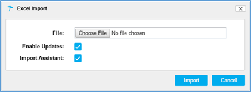

# PoolParty Project

## How do I create a project?

You will need to have a project before you can get started. This is done from the PoolParty Dashboard which is available after logging into PoolParty. From the main menu at the top of the PoolParty window, click on “Project” and select “Create Project”.

You should then choose “Create Empty Project” from “Create Project” dialog. This will create a new project whose Hierarchy Tree is only composed of the empty project node itself, Lists and Collections.

The resulting project could look like this:

## Where to put a taxonomy into PoolParty? 

Just inside a PoolParty project” Once you have created a Project, you can access it any time you wish. From the main menu at the top of the PoolParty window, click on “Project” and select “Open Project”. You will then be provided with a search box to select and open the project of your choice.

After you have opened your project you will have the option to import your taxonomy or part of it, preferably in small batches which allow you to better control the results and to get familiar with the system. •

## Once my PoolParty project has been created, how to populate it with my taxonomy data?

You can import your taxonomy’s items at different levels of the project Hierarchy Tree. Dealing with an empty project, you must import some concept schemes. As you can import as many PoolParty Excel sheets as you wish, you could begin with those that contain concept schemes and then, if needed, others at different levels. Right-clicking at the project level, Excel Project Import becomes available from context menu:

Something similar happens if you right-click on a lower level in the Hierarchy Tree, i.e., on an existing concept scheme, top concept or a concept previously created in the PoolParty taxonomy, Excel Subtree Import becomes available from the appearing context menu for importing concepts under that level. For instance, let’s suppose that you have already created in PoolParty the project named “MEA Project” with two concept scheme or thesauri named “MEA Legal Scheme” and “MEA Scientific Scheme” that, in turn, have the top concept “National legislation” under the former and the two top concepts “Assessments”, and “Publications” under the later.

Now, if you right-click on the top concept “National legislation”, you can choose the Excel Subtree Import option to create narrower concepts \(e.g. “Country names”\):

Using the Excel import function, you not only can add new data to your taxonomy, but can also update existing data or add labels and relations to the taxonomy. A good approach is to partially create the hierarchy within PoolParty , even including some concepts, and then export files in Excel format by right-clicking on a node \(Scheme, Top concept or Concept\) of that hierarchy. This will give you a properly formatted Excel sheet with the required columns which you can later modify or expand accordingly to your needs by adding your new concepts or synonyms, definitions, etc., and next using the resulting Excel sheet for importing or adding new data. You can import your new data by right-clicking on any taxonomy’s node you get a context menu and, at the Import option, you can select Excel Project Import or Excel Subtree Import \(depending on the level of the node\):

Import at Project level

## Importing new data 

It is referred to one of the following actions: 1\) Create a new project from scratch; and 2\) Add new concept schemes, top concepts or concepts that were not there before.

## Adding new data 

Alternatively, adding new data to existing data such as new properties or labels for existing concepts, custom attributes, custom classes or relations has a broader scope. In this case, PoolParty will check if the concept referenced in import already exists, in which case the data in the import file is added to the existing concept; existing data associated to the concept will not be updated by overwriting existing values. If the concept referenced in import does not exist, i.e. it is a new one, it will be added as new data. The “add data” feature in Excel import function has to be activated by checking the box for Enable Updates in the Excel Import dialog:

## Duplicated concepts 

It is very important to make sure you check that box when adding new data for avoiding the creation of duplicated concepts because it assures those existing concepts will be reused. It is especially important when you use multilingual thesauri, which will be a frequent case to the MEAs. 

## Editing concepts 

You can edit the metadata, labels, relations etc. of your project, concept schemes and concepts. At the concept's Detail View, you can find some inline editing functions:

It is a good practice to add alternative labels as synonyms of the preferred label for the concept and also fill its Definition field with a verbose description of the concept.

## Adding relations 

You can add new semantic data as relations to a concept scheme or concept.

Clicking the linking icons in the concerned relation area, the Add Relation dialog opens \(with autocomplete feature\):

Or, simply, you can drag and drop the concept into the concerned relation area:

## Mapping data 

You can enrich the concepts in the thesaurus by linking them to data from the available linked data cloud, i.e., Linked Open Data \(LOD\) Cloud and PoolParty Linked Data.

By default, there are available several Linked Data Sources in PoolParty from LOD that you can use out-of-the-box: Wikipedia's data as linked data source DBpedia \(en, de, es, fr, nl, ru\); Wikipedia's categories as linked data DBpedia categories \(en, de, es, fr, nl, ru\); geographical database GeoNames covering all countries; Getty Vocabularies \(AAT, TGN, ULAN\) of terminology for art, architecture, decorative arts, archival materials, visual surrogates, conservation, and bibliographic materials; PermID containing data about organizations, instruments, funds, issuers and people; programmatic access to LCSH \(Library of Congress Subject Headings, en\); lexical database of English WordNet; and Wikidata, a semantic version of Wikipedia.

The same applies to published PoolParty projects \(for instance, those that are part of the predefined PoolParty group “Public”, e.g. LEO Thesaurus or BRS Trial Project in our current test server\).

## o Linking LOD and PP sources to a project

 In order to mapping concepts in your project, It is a pre-requisite to previously have used the Linked Data Administration or Linked Projects in the Advanced menu from the PoolParty’s main menu to actually link some LOD sources or PP sources, respectively. You should have into account that the Advanced menu is only available for users with the PoolPartyAdmin user role.

After that, you may find the links "Link to LOD" and "Link to PP" in the concept's Detail View:

Let's illustrate the use of these links in the next pages.

## Link to LOD

Now, if you \(1\) click on “Link to LOD” \(equivalent to select “Linked Data” tab of the concept\), you \(2\) choose the concerned linked data source \(e.g. EnDBPedia\) and successively \(3\) click the “Link to EnDBPedia” button, then it is opened the Lookup dialog, where you can search, from the linked data source selected, for concepts to be considered in the mappings:

To map the data with adequate relations, use the Mapping Type drop down.

Thus, you obtain a result like this:

That, finally, looks like this in the concept's Detail View \(zoomed\):

Or in the full view:

## o “Link to PP” 

Alternatively, if you click on “Link to PP”, you can choose matching labels to the concept from the previously linked PoolParty projects in an automatically generated search list, to be considered in the mappings:

After selecting the desired matching labels by using the check boxes, we arrive to:

Now you can see, besides the LOD's, the PP mappings \(as Exact Matching Concepts in this example\) to linked projects, namely, LEO Thesaurus... and BRS Trial...

## • “How to protect me from data loses or corruption?” 

The better protection for your data is a good backup. Additionally, you could use the PoolParty snapshots feature. o Export project to backup data We have mainly dealt with Excel format, but there is also possible to use RDF format. You can backup your entire project from the “Project” menu in the “Main Menu” by selecting “Export” in either Excel or RDF format.

Although you can use Excel exports for working purposes, it is recommended to use RDF exports for backup entire project \(be sure to check the corresponding box\). RDF Project Export using the export format Trix or Trig will ensure that the relations and mappings, notes added to concepts and subproperty definitions are exported.

An archive with the extension .ppar is generated holding all data to copy, move or restore your project. By default, the file name is 'pp_project_.ppar'.

## o Snapshots

When a project is opened, a check is made whether the data in the project is valid. If any changes in the data compared to the last status \(status at last logout\) is detected, PoolParty assumes that there is something wrong and an error message is displayed. Via the Snapshot Dashboard you can restore a project from a snapshot with the correct data or trigger a manual snapshot if your data is OK.

You can restore and download snapshots and also change the snapshot settings. The Snapshot Configuration should be set as follows: Auto save interval for project can be set between 5 ,10 ,15 and 30 min. Please tick the homonymous box that saves your work on exit.

If you do not have access to the Snapshot Configuration refer to InforMEA team PP focal point.

In addition, you can create snapshots manually. This is a recommended backup whenever you import/add large amount of metadata via Import Assistant, in particular if the import contains major issues after storing the data and cannot be repaired appropriately.

